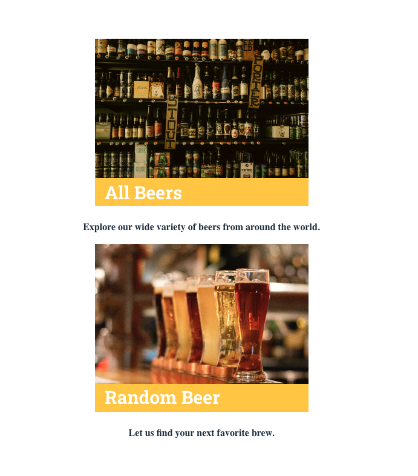
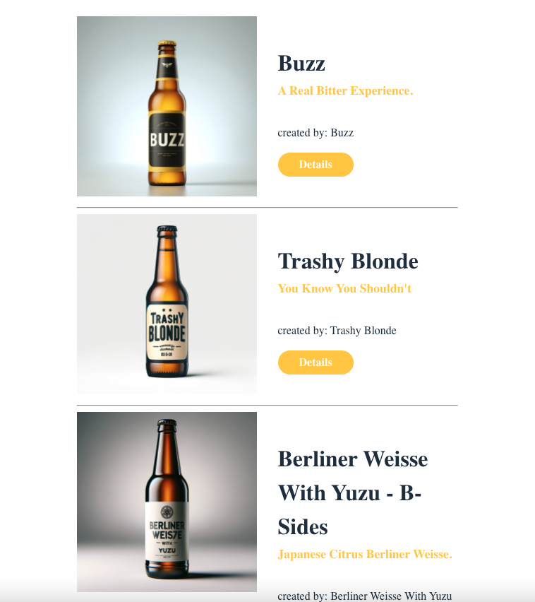

# Project Beer API 🍻

## Overview

This project implements a beer selection web application based on a pre-designed Figma layout. The application is built using CSS, TypeScript, React, and react-router-dom for navigation across multiple pages. Data is fetched from a free API to display a variety of beer options.

## Preview

Check it out[here... 🍺](https://beer-shop-api.netlify.app/)

## Features

- Home Page: Navigate through different sections to explore a wide selection of beers.

- Beer Selection: Click on a specific beer to view more details on a separate page.

- Back Navigation: Return to the previous view using a back button.

- Random Beer Recommendation: Get a random beer recommendation from the home page to view its details directly.

- Footer Navigation: Return to the home page from any page using the footer logo.

## Technologies Used

- CSS: Styling the application according to the Figma design.

- TypeScript: Adding static type definitions for better code quality and maintainability.

- React: Building the user interface and managing the component state.

- react-router-dom: Handling the routing between different pages of the application.

- Free API: Fetching data to display a variety of beers.

## How to Run the Project

1. Clone the repository:

sh
`git clone git@github.com:sharonVko/Project-Beer_API.git`

2. Navigate to the project directory:

`cd beer-api-project`

3. Install dependencies:

`npm install`

4. Start the development server:

`npm run dev`

5. Open your browser to see the application in action.

## Usage

- Home Page: Explore different sections and select a beer to see detailed information.

- Beer Details: View detailed information about the selected beer and use the back button to return to the previous page.

- Random Beer: Get a random beer recommendation and view its details directly.

- Footer Navigation: Use the footer logo to navigate back to the home page from any page.

## Contributing

Feel free to fork this repository, make improvements, and submit a pull request. Contributions are welcome!
